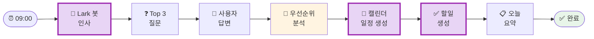
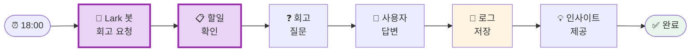

# daily-focus 설계서

> 📋 **이 설계서는 [사전설문응답.md](사전설문응답.md) 인터뷰를 바탕으로 작성되었습니다.**

> ⚠️ **이 설계서는 초안입니다!**
>
> 정답이 아니에요. 워크샵 당일 강사님과 함께 범위를 더 좁히거나, 더 구체화할 수 있습니다.
>
> **사전과제의 목적**:
> 1. 스킬을 설치해서 한 번 써본 것 ✅
> 2. 나만의 스킬 설계서를 만들어서 "아, 내 작업이 이렇게 자동화되겠구나", "이런 흐름이겠구나" 감 잡기 ✅
>
> 이 정도면 충분해요! 나머지는 워크샵에서 함께 다듬어봐요 😊

## 목차
- [0. 선언](#0-선언)
- [한눈에 보기](#한눈에-보기)
- [Core](#core-필수)
- [외부 API 연동](#외부-api-연동)
- [다음 단계](#다음-단계)

---

## 0. 선언

- **스킬 이름**: `daily-focus`
- **한 줄 설명**: Lark 봇이 아침/저녁으로 말을 걸어 오늘의 Top 3와 회고를 관리하는 데일리 우선순위 도우미
- **만드는 사람**: Head of Product
- **스킬 유형**: [x] 외부 API  [x] 다단계 워크플로우
- **MVP 목표**: "아침 9시에 Lark 봇이 자동으로 말 걸어서 Top 3를 캘린더에 등록하고, 저녁 6시에 회고를 유도하는 것"

---

## 한눈에 보기

### 외부 연동

| 서비스 | 용도 | 연동 방식 | 복잡도 | 가이드 |
|--------|------|----------|--------|--------|
| Lark | 봇 메시지 발송, 캘린더/할일 관리 | MCP (양방향) | 중간 | [📘 설정 가이드](연동가이드/lark.md) |

> 📁 상세 설정 가이드: [연동가이드/](연동가이드/) 폴더 참조

**예상 설정 시간**: 약 30분 (워크샵 전 사전 설정 권장)

### 워크플로 시각화

> 💡 **다이어그램이 안 보이나요?**
>
> VSCode에서 Mermaid 다이어그램을 보려면 확장 프로그램이 필요해요:
> 1. VSCode 왼쪽 사이드바에서 **확장(Extensions)** 아이콘 클릭 (또는 `Cmd+Shift+X`)
> 2. `Markdown Preview Mermaid Support` 검색
> 3. **Install** 클릭
> 4. 이 파일을 다시 열고 **미리보기**(`Cmd+Shift+V`)로 확인!

**아침 플로우**:


**저녁 플로우**:


---

## Core (필수)

### 1. 언제 쓰나요?

**대표 상황**:
- 아침: 하루를 시작하면서 오늘 뭐에 집중할지 정하고 싶을 때
- 저녁: 하루를 마무리하면서 오늘 뭘 했는지 돌아보고 싶을 때
- 미팅에 치여서 정작 중요한 일을 못 하는 상황을 개선하고 싶을 때

**왜 필요한가**:
- 현재: 미팅이 너무 많아서 중요한 일에 집중 못함
- 목표: 매일 "제일 중요한 일 3개"를 정의하고 집중하는 습관
- 빈도: 매일 (아침 1회, 저녁 1회)

### 2. 사용법

**이렇게 부르면**:
- 자동 트리거: 아침 9시, 저녁 6시 (설정 가능)
- 수동 트리거: `/daily-focus` (아침), `/daily-review` (저녁)
- Lark 그룹방에 봇이 먼저 말을 걸어옴

**결과물 형태**: [x] 메시지 (Lark 그룹)  [x] 캘린더 일정  [x] 할일 체크리스트

**결과물 예시**:
> **🌅 좋은 아침이에요!**
>
> 오늘 가장 중요한 3가지는 뭐예요?
>
> [사용자 답변 후]
>
> **✅ 오늘의 Top 3**
> 1. [우선순위 1] - 캘린더에 2시간 블록 추가 ✓
> 2. [우선순위 2] - 캘린더에 1시간 블록 추가 ✓
> 3. [우선순위 3] - 할일로 추가 ✓
>
> 오늘도 집중해봐요! 💪

### 3. 입력/출력 명세

| 구분 | 내용 |
|------|------|
| **사용자 입력** | 자연어 (Top 3 우선순위 설명) |
| **필수 옵션** | 없음 (대화형) |
| **선택 옵션** | 시간 블록 지정 (기본: AI가 추천) |
| **출력 규칙** | Lark 메시지 + 캘린더 일정 + 할일 체크리스트 |

### 4. 범위

**하는 것**:
1. 아침: Lark 그룹에 능동적으로 말 걸기 → Top 3 대화 → 캘린더/할일 등록
2. 저녁: Lark 그룹에 회고 요청 → 오늘 뭐 했는지 대화 → 로그 저장
3. 대화 기반 입력 (자연어 이해)

**안 하는 것**:
1. 자동 우선순위 제안 (사용자가 직접 정의)
2. 복잡한 프로젝트 관리 (간단한 Top 3만)

### 5. 데이터/도구/권한

| 항목 | 내용 |
|------|------|
| **읽는 데이터** | Lark 캘린더 (시간 블록 확인), 할일 현황 |
| **쓰는 위치** | Lark 캘린더 (일정 생성), Lark 할일 (체크리스트), 로컬 회고 로그 |
| **외부 서비스** | Lark (Bot + Calendar + Todo API) |
| **민감정보** | Lark Bot Token, 개인 일정, 회고 내용 |

### 6. 실패/예외 처리

**예상되는 실패 상황**:
1. Lark 그룹에 메시지 발송 실패
2. 캘린더 일정 생성 실패 (권한, 시간 충돌)
3. 사용자가 응답하지 않음

**실패 시 안내 원칙**:
- 메시지 실패: "봇이 그룹에 접근할 수 없어요. 봇을 그룹에 다시 초대해주세요."
- 일정 충돌: "이 시간에 이미 일정이 있어요. 다른 시간을 제안해도 될까요?"
- 무응답: 1시간 후 재시도 (최대 1회)

### 7. 대화 시나리오

**정상 케이스 (아침)**:

**봇 (자동)**: "🌅 좋은 아침이에요! 오늘 가장 집중하고 싶은 3가지는 뭐예요?"

**나**: "1. 신규 기능 PRD 작성, 2. PM 팀 1on1, 3. Q1 로드맵 검토"

**봇**:
> ✅ 알겠어요! 오늘의 Top 3를 캘린더에 넣어드릴게요.
>
> **1. 신규 기능 PRD 작성**
> - 오전 10시~12시 (2시간 블록)
>
> **2. PM 팀 1on1**
> - 오후 2시~3시 (이미 일정 있음)
>
> **3. Q1 로드맵 검토**
> - 할일로 추가했어요 (틈날 때 하세요!)
>
> 오늘도 화이팅! 💪

**정상 케이스 (저녁)**:

**봇 (자동)**: "🌙 하루 고생하셨어요! 오늘 Top 3 중에 뭐 하셨어요?"

**나**: "PRD는 80% 완성, 1on1 했고, 로드맵은 못 봤어"

**봇**:
> 수고하셨어요! 오늘 정리해드릴게요.
>
> ✅ PRD 작성 (80% 완료)
> ✅ 1on1 (완료)
> ⏳ 로드맵 검토 (미완)
>
> **인사이트**: 오늘 2/3 달성! 로드맵은 내일 아침 Top 3에 넣어볼까요?
>
> 편히 쉬세요! 😊

### 8. 테스트 & 완료 기준

**테스트 체크리스트**:
- [ ] 아침 9시 자동 메시지 발송
- [ ] Top 3 입력 후 캘린더 일정 생성
- [ ] 저녁 6시 회고 메시지 발송
- [ ] 무응답 시 1시간 후 재시도
- [ ] 일정 충돌 시 대체 시간 제안

**Done 기준**:
"하루 동안 봇이 아침/저녁 2번 말 걸어서, Top 3가 캘린더에 들어가고 저녁에 회고가 기록되는 것"

---

## 외부 API 연동

1개의 외부 서비스 연동이 필요합니다.

### 환경변수 요약

| 변수명 | 서비스 | 발급 방법 |
|--------|--------|----------|
| `LARK_BOT_TOKEN` | Lark | [Lark 개발자 콘솔](https://open.larksuite.com) → 봇 생성 → Bot Token 복사 |

> **Tip**: Claude Code에게 API 키를 알려주면 자동으로 `.env`에 설정해줘요!
> 예: "라크 토큰은 xoxb-xxxx야"

### 연동 상세

#### Lark Bot API (양방향)

| 항목 | 내용 |
|------|------|
| **Context7 Library ID** | `/websites/open_larksuite_document` |
| **필요한 credential** | Bot User Access Token |
| **환경변수** | `LARK_BOT_TOKEN` |
| **복잡도** | 중간 |
| **예상 설정 시간** | 30분 |

**설정 가이드 요약**:
1. [Lark 개발자 콘솔](https://open.larksuite.com) 접속
2. "Create App" → 앱 이름 입력 (예: "Daily Focus Bot")
3. "Bot" 기능 활성화
4. 권한 추가:
   - `im:message` (메시지 발송)
   - `im:chat` (그룹 채팅 접근)
   - `calendar:calendar` (캘린더 읽기/쓰기)
   - `task:task` (할일 생성)
5. "Install to Workspace" → Bot Token 복사
6. 봇을 원하는 Lark 그룹에 초대
7. 스케줄 설정 (cron job): 아침 9시, 저녁 6시

**추가 설정: 스케줄러**
- 방법 1: Lark 앱에서 "Scheduled Message" 기능 활성화
- 방법 2: 로컬 cron job으로 스킬 트리거
  ```bash
  # crontab -e
  0 9 * * * /usr/local/bin/claude-code "/daily-focus"
  0 18 * * * /usr/local/bin/claude-code "/daily-review"
  ```

> 📘 상세 가이드: [연동가이드/lark.md](연동가이드/lark.md)

---

## 다음 단계

### 워크샵 전 준비사항

1. **환경변수 설정** (`.env.example` 참조)
2. **Lark 봇 생성** ([연동가이드/lark.md](연동가이드/lark.md) 참조)
3. **스케줄러 설정** (cron job 또는 Lark Scheduled Message)

### 워크샵 당일

1. 이 설계서 가져오기
2. 강사님과 범위 조정 (필요시)
3. 스킬 구현 시작!

### 구현 후 (배포)

워크샵에서 스킬을 완성한 후:

1. Claude Code에게 "이 스킬 배포해줘"라고 말하기
2. GitHub 레포 자동 생성
3. 설치 명령어 받기
4. 팀원들에게 공유!

---

## 나중에 더 발전시킬 아이디어

- [ ] 주간 리포트 (월요일 아침 지난주 요약)
- [ ] 패턴 분석 (자주 미루는 태스크 알림)
- [ ] 팀원과 공유 (팀 대시보드)
- [ ] Slack 연동 (Lark 대신)

---

**워크샵 당일 이 설계서 가져오세요!** 🚀
