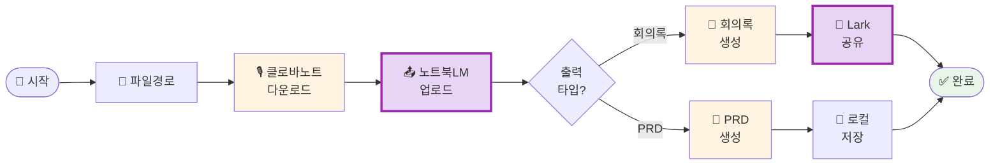

# meeting-automation 설계서

> 📋 **이 설계서는 [사전설문응답.md](사전설문응답.md) 인터뷰를 바탕으로 작성되었습니다.**

> ⚠️ **이 설계서는 초안입니다!**
>
> 정답이 아니에요. 워크샵 당일 강사님과 함께 범위를 더 좁히거나, 더 구체화할 수 있습니다.
>
> **사전과제의 목적**:
> 1. 스킬을 설치해서 한 번 써본 것 ✅
> 2. 나만의 스킬 설계서를 만들어서 "아, 내 작업이 이렇게 자동화되겠구나", "이런 흐름이겠구나" 감 잡기 ✅
>
> 이 정도면 충분해요! 나머지는 워크샵에서 함께 다듬어봐요 😊

## 목차
- [0. 선언](#0-선언)
- [한눈에 보기](#한눈에-보기)
- [Core](#core-필수)
- [외부 API 연동](#외부-api-연동)
- [다음 단계](#다음-단계)

---

## 0. 선언

- **스킬 이름**: `meeting-automation`
- **한 줄 설명**: 클로바노트 음성기록을 노트북LM으로 처리하여 회의록/PRD를 자동 생성하고 Lark에 공유
- **만드는 사람**: Head of Product
- **스킬 유형**: [x] 외부 API  [x] 다단계 워크플로우
- **MVP 목표**: "클로바노트에서 다운로드한 파일을 지정하면, 회의록이 Lark에 자동으로 올라가는 것"

---

## 한눈에 보기

### 외부 연동

| 서비스 | 용도 | 연동 방식 | 복잡도 | 가이드 |
|--------|------|----------|--------|--------|
| 클로바노트 | 음성기록 다운로드 | Playwright (브라우저 자동화) | 중간 | [📘 설정 가이드](연동가이드/playwright.md) |
| NotebookLM | 파일 업로드 & 회의록 생성 | MCP | 쉬움 | [📘 설정 가이드](연동가이드/notebooklm.md) |
| Lark | 회의록 그룹 공유 | API (스크립트) | 중간 | [📘 설정 가이드](연동가이드/lark.md) |

> 📁 상세 설정 가이드: [연동가이드/](연동가이드/) 폴더 참조

**예상 설정 시간**: 약 40-50분 (워크샵 전 사전 설정 권장)

### 워크플로 시각화

> 💡 **다이어그램이 안 보이나요?**
>
> VSCode에서 Mermaid 다이어그램을 보려면 확장 프로그램이 필요해요:
> 1. VSCode 왼쪽 사이드바에서 **확장(Extensions)** 아이콘 클릭 (또는 `Cmd+Shift+X`)
> 2. `Markdown Preview Mermaid Support` 검색
> 3. **Install** 클릭
> 4. 이 파일을 다시 열고 **미리보기**(`Cmd+Shift+V`)로 확인!

---

## Core (필수)

### 1. 언제 쓰나요?

**대표 상황**:
- 회의가 끝나고 클로바노트에 음성기록이 쌓여 있을 때
- 회의록을 팀에 공유해야 할 때
- 제품 회의에서 PRD 초안이 필요할 때

**왜 필요한가**:
- 현재: 매일 5분씩 수동 작업 (월 2.5시간, 연 30시간)
- 귀찮음: 클로바노트 → 다운로드 → 노트북LM → 업로드 → 결과 복사 → Lark 붙여넣기
- 빈도: 매일 (위클리 미팅, 1on1 등 미팅이 많음)

### 2. 사용법

**이렇게 부르면**:
- `/meeting` (메뉴 선택: 회의록 or PRD)
- "회의록 만들어줘"
- "이 회의 PRD로 정리해줘"

**결과물 형태**: [x] 메시지 (Lark 그룹)  [x] 파일 (PRD 로컬 저장)

**결과물 예시**:
> **회의록 - 2025년 2월 4일 제품 전략 회의**
>
> 참석자: [자동 인식]
>
> **주요 논의사항**
> - [노트북LM이 요약]
>
> **결정사항**
> - [액션 아이템 자동 추출]
>
> **다음 액션**
> - [ ] [담당자] [할 일]

### 3. 입력/출력 명세

| 구분 | 내용 |
|------|------|
| **사용자 입력** | 클로바노트 다운로드 파일 경로 또는 URL |
| **필수 옵션** | 출력 타입 (회의록 / PRD) |
| **선택 옵션** | Lark 그룹 지정 (기본값: 설정된 그룹) |
| **출력 규칙** | 회의록: Lark 그룹 메시지, PRD: `./output/PRD_YYYYMMDD.md` |

### 4. 범위

**하는 것**:
1. 클로바노트 음성기록 파일 자동 다운로드 (또는 파일 경로 입력)
2. 노트북LM에 업로드하여 회의록/PRD 생성
3. 회의록은 Lark 그룹에 자동 공유, PRD는 로컬 저장

**안 하는 것**:
1. 실시간 음성 녹음 (클로바노트 앱 사용)
2. 회의 일정 자동 매칭 (수동 지정)

### 5. 데이터/도구/권한

| 항목 | 내용 |
|------|------|
| **읽는 데이터** | 클로바노트 다운로드 폴더, 음성기록 파일 |
| **쓰는 위치** | `./output/` 폴더 (PRD), Lark 그룹 (회의록) |
| **외부 서비스** | 클로바노트, NotebookLM (MCP), Lark (Bot API) |
| **민감정보** | Lark Bot Token, NotebookLM 인증, 회의 내용 |

### 6. 실패/예외 처리

**예상되는 실패 상황**:
1. 클로바노트 파일을 찾을 수 없음
2. 노트북LM 업로드 실패 (파일 형식, 크기 제한)
3. Lark 그룹 메시지 발송 실패 (권한, 네트워크)

**실패 시 안내 원칙**:
- 명확한 에러 메시지: "클로바노트 파일을 찾을 수 없어요. 경로를 확인해주세요: [경로]"
- 대체 경로 제시: "수동으로 파일을 업로드하시겠어요? (y/n)"
- 부분 성공: "회의록은 생성됐는데 Lark 공유는 실패했어요. 클립보드에 복사했으니 직접 붙여넣어주세요."

### 7. 대화 시나리오

**정상 케이스**:

**나**: "/meeting"

**스킬**:
> 어떤 회의록을 만들까요?
> 1. 회의록 (요약 + 액션아이템)
> 2. PRD (제품 요구사항 문서)
>
> 클로바노트 파일 경로를 알려주세요.

**나**: "1. 회의록, ~/Downloads/meeting_20250204.txt"

**스킬**:
> ✅ 파일 확인했어요!
> 🔄 노트북LM에 업로드 중...
> ✅ 업로드 완료!
> 📝 회의록 생성 중...
> ✅ 회의록 완성!
> 💬 Lark 그룹에 공유했어요!

### 8. 테스트 & 완료 기준

**테스트 체크리스트**:
- [ ] 클로바노트 샘플 파일로 회의록 생성
- [ ] PRD 생성 후 로컬 파일 확인
- [ ] Lark 그룹에 회의록 정상 발송
- [ ] 잘못된 파일 경로 에러 처리
- [ ] 노트북LM 업로드 실패 시 안내

**Done 기준**:
"클로바노트 파일만 지정하면, 1분 안에 Lark 그룹에 회의록이 올라가고 있는 것"

---

## 외부 API 연동

3개의 외부 서비스 연동이 필요합니다.

### 환경변수 요약

| 변수명 | 서비스 | 발급 방법 |
|--------|--------|----------|
| `LARK_BOT_TOKEN` | Lark | [Lark 개발자 콘솔](https://open.larksuite.com) → 봇 생성 → Bot Token 복사 |
| (자동 관리) | NotebookLM | MCP 서버 설정 시 자동 인증 (Google OAuth) |
| (자동 관리) | 클로바노트 | 브라우저 자동화 (로그인 필요시 세션 저장) |

> **Tip**: Claude Code에게 API 키를 알려주면 자동으로 `.env`에 설정해줘요!
> 예: "라크 토큰은 xoxb-xxxx야"

### 연동 상세

#### Lark Bot API

| 항목 | 내용 |
|------|------|
| **Context7 Library ID** | `/websites/open_larksuite_document` |
| **필요한 credential** | Bot User Access Token |
| **환경변수** | `LARK_BOT_TOKEN` |
| **복잡도** | 중간 |
| **예상 설정 시간** | 20-30분 |

**설정 가이드 요약**:
1. [Lark 개발자 콘솔](https://open.larksuite.com) 접속
2. "Create App" → 앱 이름 입력
3. "Bot" 기능 활성화
4. 권한 추가: `im:message`, `im:chat`, `calendar:calendar`
5. "Install to Workspace" → Bot Token 복사
6. 봇을 Lark 그룹에 초대

> 📘 상세 가이드: [연동가이드/lark.md](연동가이드/lark.md)

#### NotebookLM MCP

| 항목 | 내용 |
|------|------|
| **Context7 Library ID** | `/jacob-bd/notebooklm-mcp-cli` |
| **필요한 credential** | Google OAuth (자동 인증) |
| **환경변수** | 없음 (MCP 서버가 관리) |
| **복잡도** | 쉬움 |
| **예상 설정 시간** | 10-15분 |

**설정 가이드 요약**:
1. `~/.mcp.json`에 NotebookLM MCP 서버 추가
2. Claude Code 재시작
3. 첫 사용 시 Google 로그인 (브라우저 팝업)
4. 인증 완료 후 자동 연결

> 📘 상세 가이드: [연동가이드/notebooklm.md](연동가이드/notebooklm.md)

#### 클로바노트 (브라우저 자동화)

| 항목 | 내용 |
|------|------|
| **Context7 Library ID** | `/microsoft/playwright` |
| **필요한 credential** | 네이버 로그인 (세션 저장) |
| **환경변수** | 없음 (세션 파일로 관리) |
| **복잡도** | 중간 |
| **예상 설정 시간** | 20-30분 |

**설정 가이드 요약**:
1. Playwright 설치: `npm install playwright`
2. 브라우저 설치: `npx playwright install chromium`
3. 첫 실행 시 네이버 로그인 (수동)
4. 세션 저장 → 이후 자동 로그인

> 📘 상세 가이드: [연동가이드/playwright.md](연동가이드/playwright.md)

---

## 다음 단계

### 워크샵 전 준비사항

1. **환경변수 설정** (`.env.example` 참조)
2. **Lark 봇 생성** ([연동가이드/lark.md](연동가이드/lark.md) 참조)
3. **NotebookLM MCP 설치** ([연동가이드/notebooklm.md](연동가이드/notebooklm.md) 참조)
4. **Playwright 설치** (선택)

### 워크샵 당일

1. 이 설계서 가져오기
2. 강사님과 범위 조정 (필요시)
3. 스킬 구현 시작!

### 구현 후 (배포)

워크샵에서 스킬을 완성한 후:

1. Claude Code에게 "이 스킬 배포해줘"라고 말하기
2. GitHub 레포 자동 생성
3. 설치 명령어 받기
4. 팀원들에게 공유!

---

## 나중에 더 발전시킬 아이디어

- [ ] 클로바노트 자동 감지 (다운로드 폴더 모니터링)
- [ ] 회의 일정과 자동 매칭 (캘린더 연동)
- [ ] 여러 회의록 일괄 처리
- [ ] 회의록 템플릿 커스터마이징

---

**워크샵 당일 이 설계서 가져오세요!** 🚀
